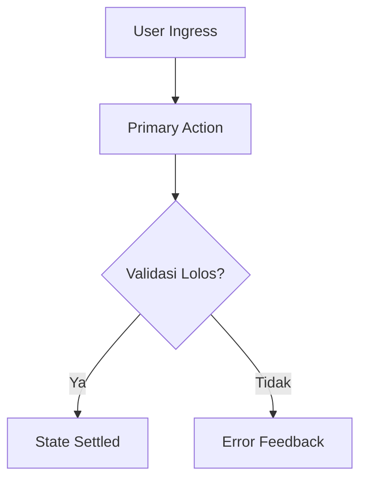

# PRODUCT REQUIREMENT DOCUMENT (PRD) — MASTER TEMPLATE

> **Otoritas Tata Kelola**: Sovereign Agent OS Governance  
> **Standar Rujukan**: `09-Panduan-Projek/WORKFLOW-AI-AGENT-STANDARD.md` (Tahap 0 & Tahap 1)

---

## PANDUAN PEMILIHAN JALUR (TRACK SELECTION MATRIX)

Sebelum menyusun PRD, tentukan jalur spesifikasi berdasarkan kompleksitas:

| Parameter | Track A: Lite / 1-Page PRD | Track B: Full Enterprise PRD |
|---|---|---|
| **Kategori Ide** | T1 (Utilitas, bugfix struktural, skrip CLI, komponen UI mandiri) | T2 / T3 (SaaS MVP, marketplace, sistem pembayaran, multi-role) |
| **Estimasi Waktu** | < 1 - 2 minggu | > 2 - 8 minggu |
| **Format yang Dipakai** | Gunakan **Template Bagian A** di bawah ini | Gunakan **Template Bagian B** (15 Seksi Lengkap) di bawah ini |

---

# BAGIAN A: TEMPLATE TRACK A (LITE / 1-PAGE PRD)
*Gunakan template ini untuk perubahan cepat berisiko rendah tanpa birokrasi berlebihan.*

## 1. Executive Summary & Problem Statement
- **Feature / Product Name**: [Nama Fitur / Utilitas]
- **Target Audience**: [Persona pengguna langsung]
- **Core Problem**: [Masalah spesifik yang diselesaikan — wajib konkret & terukur]
- **Value Proposition**: [Solusi inti & manfaat langsung]

## 2. Scope & Invariants (Mandatory Boundaries)
- **In-Scope**: [Apa yang dibangun pada iterasi ini]
- **Non-Goals (WAJIB)**: [Apa yang secara sadar TIDAK dibangun untuk mencegah scope creep]

## 3. Functional Requirements & User Stories
- **User Story**: As a [role], I want [action] so that [benefit].
- **Acceptance Criteria**:
  - [ ] Criteria 1 (Spesifik & Terukur)
  - [ ] Criteria 2 (Data Contract / Output format)

## 4. Technical Stack & Architectural Constraints
- **Runtime / Framework**: [Contoh: Node.js / Go / Python / Astro]
- **Dependencies**: Zero-dependency standard atau minimalis (Prinsip Ponytail / YAGNI).
- **Security & Privacy**: Zero hardcoded credentials, least-privilege permissions.

## 5. Machine-Verifiable Definition of Done (DoD)
- [ ] Linter & Typecheck exit code 0 (`npm run lint`, `tsc --noEmit`, atau compiler setara).
- [ ] Unit / Integration test suite exit code 0 (`tests_executed > 0`).
- [ ] 0 Emoji across all code, commits, and logs.

---

# BAGIAN B: TEMPLATE TRACK B (FULL ENTERPRISE PRD — 15 SECTIONS)
*Gunakan template ini untuk sistem menyeluruh. Semua seksi wajib ada; jika tidak relevan, isi "N/A" beserta alasannya.*

## 1. Overview & Executive Summary
- **Product Name**: [Nama Produk]
- **Elevator Pitch**: [Deskripsi ringkas 1-2 kalimat]
- **Business Context**: [Latar belakang bisnis & pasar]

## 2. Problem Statement & Strategic Goals
- **Falsifiable Problem**: [Masalah nyata yang dihadapi user/bisnis]
- **Strategic Goals**: [Tujuan jangka pendek dan jangka panjang]

## 3. User Personas & Roles Matrix
| Role / Persona | Karakteristik / Hak Akses | Pain Points | Primary Use Case |
|---|---|---|---|
| Admin | Kontrol penuh sistem, kelola user & finansial | Audit trail rumit | Monitoring & governance |
| Regular User | Operasional standar, akses data terbatas | Interface lambat | Eksekusi task harian |

## 4. Scope, MVP Boundary & Explicit Non-Goals
- **MVP In-Scope**: [Fitur minimum viable untuk rilis fase 1]
- **Future Roadmap (Fase 2+)**: [Fitur lanjutan yang ditunda]
- **Strict Non-Goals (WAJIB)**: [Fitur atau asumsi yang ditolak secara sadar]

## 5. Platform Architecture & UX Design Directives
- **Target Platform**: [Web Desktop / Mobile Responsive / Native CLI]
- **Design Principles**: [Design System reference, tipografi, tema, a11y WCAG 2.2 AA]

## 6. Menu & Feature Hierarchy
- [ ] Module 1: [Dashboard / Catalog / Settings]
  - Sub-fitur 1.1: [Detail]
  - Sub-fitur 1.2: [Detail]

## 7. User Flow & State Diagrams

## 8. Functional Requirements & Data Contracts
- **Data Model / Schema**: [Struktur entitas inti & relasi]
- **API Contracts**: [Endpoint, request payload, response schema]

## 9. Business Processes & State Machine
- [Definisi transisi status, edge case handling, dan idempotency rules]

## 10. Technical Stack & Integration Points
- **Core Runtime & DB**: [Bahasa, framework, storage engine]
- **Third-Party Integrations**: [External APIs, webhook listeners]
- **Performance Budget**: TTFB < 200ms, LCP < 1.2s, Core Web Vitals strictly green.

## 11. Security, Identity & Compliance Rails
- **Auth & Session**: OAuth 2.0 / JWT / PKCE / Session Cookie flags (`HttpOnly`, `SameSite`).
- **Data Protection**: Enkripsi at rest & in transit, least-privilege RBAC.
- **Audit & Anti-Exfiltration**: Zero logging of secrets/tokens.

## 12. Monetization & Pricing Model
- [Model lisensi / langganan / komisi transaksi / atau tandai N/A jika internal tool]

## 13. KPI & Success Metrics
| Kategori | Metrik | Target Awal | Cara Ukur |
|---|---|---|---|
| Leading | Aktivasi user baru | > 60% dalam 7 hari | Telemetri onboard |
| Lagging | Retensi 30-hari | > 40% | Database cohort |

## 14. Phased Implementation Roadmap
- **Paket 1 (Foundations & Core Engine)**: Chunks 1 - 10 (Sesuai Sliding Packet Window).
- **Paket 2 (Interface & Integration)**: Chunks 11 - 20.
- **Paket 3 (Hardening & Release)**: Chunks 21 - 30.

## 15. Machine-Verifiable DoD, UAT & Maintenance
- [ ] 0 Compiler / Typecheck / Linter errors.
- [ ] 100% automated test pass (Zero mock cheat, non-empty suite).
- [ ] Staging UAT passed by human sign-off.
- [ ] Rollback procedure & health diagnostic verified.

